### Hi there, 👋

[][linkedin]

I love the outdoors, and often the hobby projects I build are in some way connected to nature. 

- 🌐 Visit my [website](https://luenwarneke.com/) for more information and to get in touch.
- 👋 Check out [Wanderstories](https://wanderstories.space/) for adventure articles and map code.
- ✍️ Follow me on [YouTube](https://www.youtube.com/@luenwarneke) for more content.

---

   
   
  

---

  
  

  
  
  
  
  
  

  
  
  
  
  
  
  
  
  
  
  
  
  
  
  

[linkedin]: https://linkedin.com/in/luen-warneke

---

 
  
<h2>📕 Top Projects I've Contributed To</h2>

  

    <!---->
    
    <!---->
    
    
    

  

  

